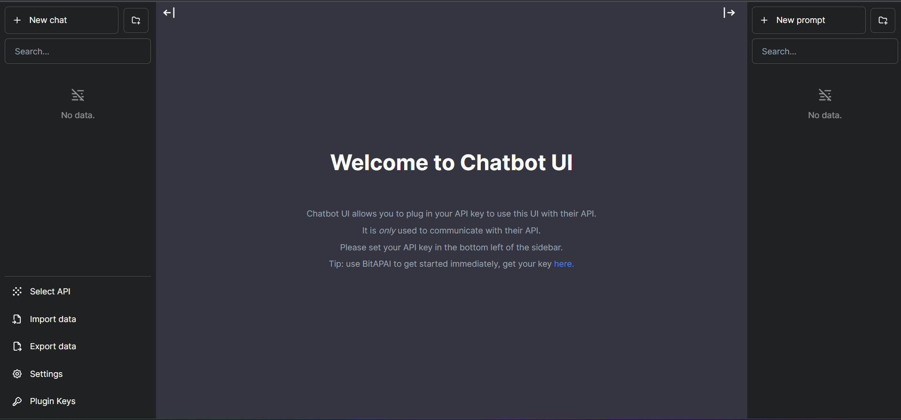

# Chatbot UI

Chatbot UI is an open source chat UI for AI models.



## Updates

Chatbot UI will be updated over time.

Expect frequent improvements.

**Next up:**

- [ ] Langchain Wrapper

## Deploy

**Vercel**

Host your own live version of Chatbot UI with Vercel.

[](https://vercel.com/new/clone?repository-url=https%3A%2F%2Fgithub.com%2Fmckaywrigley%2Fchatbot-ui)

## Adding a new API integration

To add a new API integration in the chat UI, follow these steps.

**1. Adding new API select option**

Add your API to the `~/utils/config/models.ts` file

**2. Adding API logic on the backend**

The request from frontend will be made on the route `/api/chat` which corresponds to file `~/pages/api/chat.ts`. So we will have to add our new API that we just added in the configs to the switch statement.

**3. Creating API converstation function**

Create a new file for your integration under `~/utils/server/integrations` and then export the files from `~/utils/server/index.ts`

## Running Locally

**1. Clone Repo**

```bash
git clone https://github.com/mckaywrigley/chatbot-ui.git
```

**2. Install Dependencies**

```bash
npm i
```

**3. Provide BitAPAI API Key**

Create a .env.local file in the root of the repo with your BitAPAI API Key:

```bash
BITAPAI_API_KEY=YOUR_KEY
```

> You can set `BITAPAI_API_HOST` where access to the official BitAPAI host is restricted or unavailable, allowing users to configure an alternative host for their specific needs.

**4. Run App**

```bash
npm run dev
```

**5. Use It**

You should be able to start chatting.

## Configuration

When deploying the application, the following environment variables can be set:

| Environment Variable | Default value          | Description                                              |
| -------------------- | ---------------------- | -------------------------------------------------------- |
| BITAPAI_API_KEY      |                        | The default API key used for authentication with BitAPAI |
| BITAPAI_API_HOST     | https://api.bitapai.io | The default host to make request with BitAPAI            |

If you do not provide an BitAPAI API key with `BITAPAI_API_KEY`, users will have to provide their own key.

If you don't have an BitAPAI API key, you can get one [here](https://bitapai.io).

## Contact

If you have any questions, feel free to reach out to [@crazydevlegend](https://github.com/crazydevlegend)
